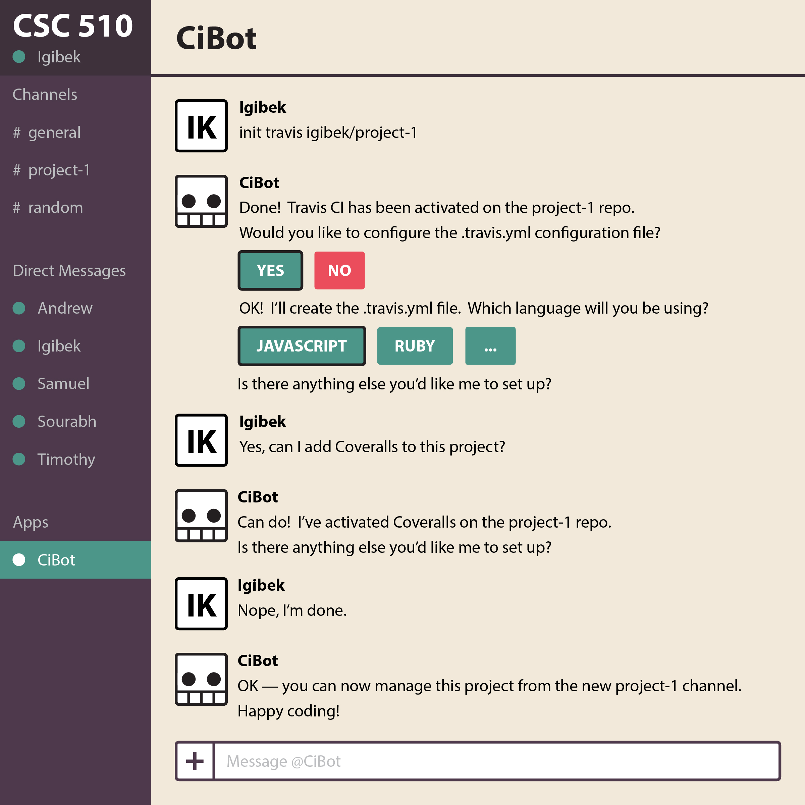
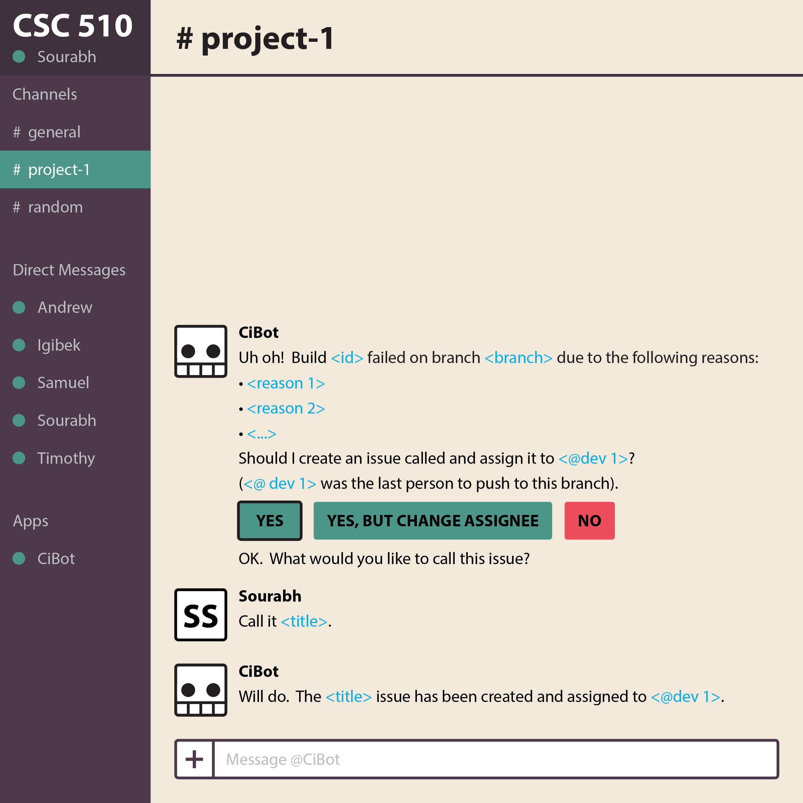
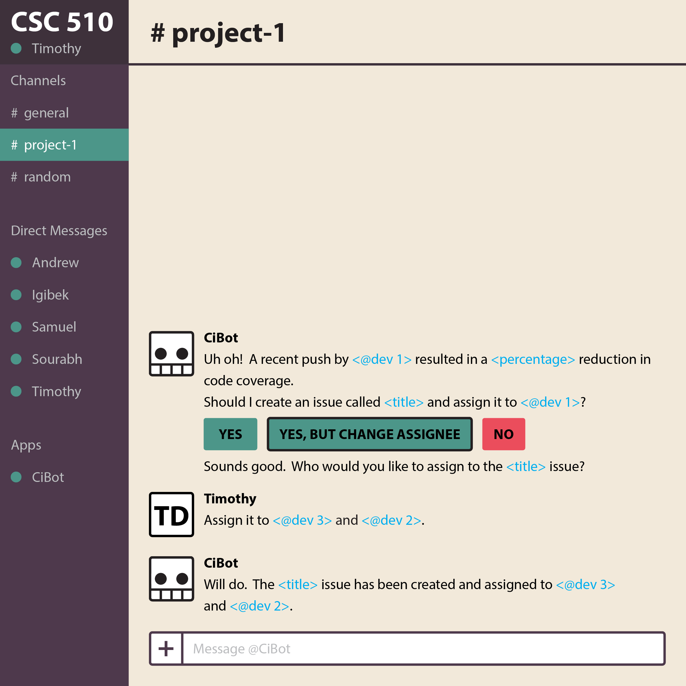
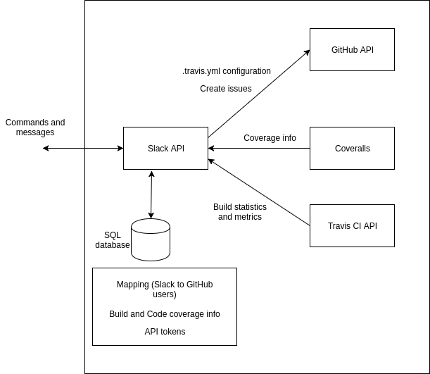

## Table of Contents

### [1. Problem Statement](#1-problem-statement-1)
### [2. Bot Description](#2-bot-description-1)
### [3. Use Cases](#3-use-cases-1)
#### [3.1 Configuring .travis.yml and .coveralls.yml](#31-configuring-travisyml-and-coverallsyml-1)
#### [3.2 Creating issues if the build fails](#32-creating-issue2-if-the-build-fails-1)
#### [3.3 Code coverage notifications](#33-code-coverage-notifications-1)
### [4. Design Sketches](#4-design-sketches-1)
### [5. Architecture Design](#5-architecture-design-1)

# Design Milestone

## 1. Problem Statement

Continuous integration (CI) is an approach to the software development process in which disparate working branches are constantly merged with the master branch, oftentimes after each incremental change or added feature.  One of the main advantages of CI is that it avoids “integration hell,” a situation that arises when individual team members work on separate branches for extended periods of time before merging to the master branch. Delaying branch merging greatly increases the chances that incompatible code changes are made which will then take an inordinate amount of time and effort to integrate.  However, CI does not come without its own problems. In order to effectively practice CI, developers need be constantly aware of broken builds and failing tests caused by these frequent changes. In order to ease the burden on the developer, companies have created tools to automate some of these routine tasks (i.e. performing automated builds of and tests on the code base).  By routinely building and testing, these tools allows bugs and other errors to be quickly discovered and resolved during the development process.  In this way, CI becomes a natural complement to test-driven development, allowing stable and deployable code to be produced throughout the development cycle.

However, these advantages also come with a cost.  Since project commit cycle strategies should be determined up front for continuous integration, the initial work required for CI projects is greater than the work for non-CI projects.  This initial work is further increased if CI tools will be used during project development as each tool also requires setup and customization for each project. While CI tools often try to simplify this initial setup process, many only provide partial solutions.  Take Travis CI, one of the most popular CI tools, as an example.  Through its GitHub app, Travis CI has simplified account creation and activation to logging into their website with GitHub credentials and clicking on a button next to the repo that you want to enable its services on.  While this sets up the integration, nothing will actually happen until a .travis.yml file is created and customized in the repository. Even though the customizations are well documented, this process is arcane to novice users and is one of the most [common complaints][1] about Travis CI.  We’ll refer to this as CI’s “inaccessibility” problem.

Another barrier to using CI effectively results from the fact that it is inherently dependent upon the total participation of the contributors to a code base, their adherence to a tightly-constrained commit cycle, and their willingness to pause development to resolve errors as they occur.  This can lead to several undesirable outcomes.  On the one hand, when a build fails, a project can grind to a halt as team members shift focus away from their currently assigned tasks in order to resolve the errors introduced into the code base.  On the other hand, if builds fail regularly due to simple and easily-remedied mistakes, the entire team can eventually abandon the CI approach entirely by simply ignoring the status of the builds and continuing on with their work as they would otherwise.  Some have argued that these outcomes [completely negate the usefulness of CI][2].  We’ll refer to this as CI’s “rigidity” problem.

A third and final problem with CI is that it often relies upon a variety of services and endpoints to function optimally, many of which are maintained from completely separate user interfaces.  Even with services that are well-linked, like Travis CI and GitHub, certain tasks still require searching back and forth between the interfaces of the different tools.  It is often desirable to include tools such as coverage analyzers or deployment platforms in the CI process, but each added service effectively adds another layer of settings, configurations, and admin panels for the users to keep track of and navigate through. Requiring developers to keep up to date with many separate tools might discourage them from taking full advantage of the benefits that CI could offer.  We’ll refer to this as CI’s “decentralized workflow” problem.

By reducing the effect of the inaccessibility, rigidity, and decentralized workflow problems, CI development may appeal to a broader base of developers who are able to take full advantage of its strengths and benefits.

[1]: https://www.g2crowd.com/products/travis-ci/reviews
[2]: http://www.yegor256.com/2014/10/08/continuous-integration-is-dead.html

## 2. Bot Description

We have chosen to address the stated problems of inaccessibility, rigidity, and decentralized workflow through creating “CiBot” — a bot that integrates the CI services of [Travis CI][TC] and [Coveralls][CA] into Slack.  Since Slack allows developers working on a common project to easily communicate on channels and direct messages, this integration of CI tools enables team members to have a single interface for interacting with other developers while also maintaining workflow through a natural language interaction with a bot.  We have chosen to use Travis CI because it is currently one of the most popular CI tools, is free to use for open-source projects, and has options to link its services to various other tools for coverage analysis, deployment, and more.  We have chosen Coveralls for similar reasons: it is popular, free for open-source projects, and relatively simple to link with GitHub and Travis CI.

**NOTE:** While there is already a [Travis CI bot for Slack][3], it is a simple notifier that sends messages for build completions and pull requests. Not only does this notifier not address the problems of continuous integration stated in the first section, it also provides very little information in its notifications.

### INACCESSIBILITY:

***Setup is time-intensive and configuration options are arcane.***

To address the problem of increased time-cost in the beginning phases of CI projects, as well as the initial learning curve of CI configuration, our bot would provide a suite of easily-understood commands for automatically creating and editing the .travis.yml file.  Our bot would be able to prompt the user for information about the project they are creating and generate a suitable configuration file.  The user would then be able to interact with the  bot at any time to edit the configuration as project requirements change.  If there are many similar projects created within a team, the bot can further reduce initialization time by saving commonly used configurations to easily deploy for future projects.  We will initially limit this feature to a couple languages and environments as a proof-of-concept, but functionality can be expanded as time allows.

### RIGIDITY:

***Build failures can cause projects to halt or the build server status to be ignored.***

To address the problem of halted progress due to build failures, our bot would parse build error messages generated and return them in an actionable format to the members of the appropriate Slack channel along with any relevant metrics(e.g. build logs, build durations, etc).  It would then ask the team if they would like to [create a GitHub issue for the build failure][4] and assign someone to the issue.  The team would have the option to choose a “you break it you fix it” model, where the bot would automatically assign these issues to the last person who made a commit (i.e., the culprit of the build failure, and also the person most likely to know what was changed and what went wrong), or alternatively the team could choose to delegate the bug fix to another team member.  The bot would also provide commands to close these issues and notify the team when they have been resolved.  This feature would prevent the entire team from halting their work on the project to track down the bug’s source — instead, in the span of a few seconds, the cause of the build failure would be identified and delegated, allowing other team members to continue their work while the assignee resolved the problem, minimizing the temptation to drift from the CI approach.

### DECENTRALIZED WORKFLOW:

***Adding helpful tools makes managing all these tools more complicated.***

To address the problem of maintaining separate tools from separate user interfaces, we intend to extend Travis CI’s Slack integration to include commands for GitHub and Coveralls (two of the most useful tools for a continuous integration project).  While Travis CI’s integration with GitHub already includes some automation (i.e., starting a build when certain conditions are met on a public repo), it does not have the robustness of handling all the available tools of GitHub’s API, and the same can be said of Coveralls.  By consolidating these tools into one user interface in Slack, the task of managing these endpoints is greatly simplified.  On a similar note, the bot can monitor and respond with information from these additional services, providing legible messages concerning open issues, decreases in coverage, or other items of note for the development team — and the team can respond in kind within the same interface.

### Why a Bot?

Since CI workflows often require using multiple tools in concert, creating a bot to act as an intermediary will drastically reduce the amount of effort to coordinate between the tools. Use of these tools is further simplified with a bot since developers can perform actions using a natural language syntax instead of having to learn specific (and potentially complex) syntax for each tool. Creating a bot with stored internal state will further reduce developer load by allowing repetitive actions to be simply replayed (i.e. deploying the same .travis.yml file to multiple repositories). If a specific monitored event can have a consistent pre-defined action, a bot is also useful for reducing the reaction time as it can respond without prompting.

### What Kind of Bot?

In terms of design and categorization, this bot would be most similar to a Space Reactor DevOps bot — it would respond both to user input and events occurring on GitHub, Coveralls, and Travis CI, but would be limited to a single project per Slack channel (a separate Slack channel can be created for each additional project).  This segregation of projects into channels would allow for certain context-based inferences (i.e., the specific GitHub repo in use, the corresponding Travis CI configurations, and the deployment platform for that project) and enforce a logical organization of projects.

[3]: https://slagit.slack.com/apps/A0F81FP4N-travis-ci
[4]: https://github.com/travis-ci/travis-ci/issues/7199
[TC]: https://travis-ci.org
[CA]: https://coveralls.io

## 3. Use Cases

### 3.1 Configuring .travis.yml and .coveralls.yml

1. Precondition

	* User must have Github api token in the system
	* User needs to setup Github repo in Travis CI
	* User has created a Node.js public project on Github

2. Main flow

  User will request configuring the .travis.yml and provide the name of public repo [S1].
  Bot asks for additional information that user must submit [S2]. Bot creates travis.yml
  file and pushes it to the repository [S3].

3. Subflows

  [S1] User provides /init travis command with name of repo

  [S2] Bot will return list of techs that it supports (ex: Node, Ruby, etc.). And user
  confirms them.

  [S3] Bot creates template travis.yml file and pushes it to the repository. The bot notifies
  the Slack channel.

4. Alternative flows

	[E1] If the repository language is not supported, the bot will return an error message and gives the link for the Travis documentation.

### 3.2 Creating issues if the build fails

1. Precondition

	* User must have Github api token in system.
	* The build should lead to a failure

2. Main flow

	Travis CI notifies bot of build failure along with the reason and uid of developer who started the build.
	Bot notifies developer of the failure and reason.
	Bot asks the developer if the failure calls for an issue to be created immediately [S1], add a different title/update assignees [S2] or not create the issue [S3].
	The bot creates an issue on the appropriate github repository branch.

3. Subflows

	[S1] The bot will auto-generate an issue name and auto-assign it to the developer who started the build. If the user accepts the auto-generated details, the issue is created immediately

	[S2] The bot will ask the developer for the issue title and to assign different people to the issue. Once the user enters these details, the issue is created by the bot

	[S3] If the user does not want to create an issue, the bot would not go forward with issue creation

4. Alternative flows

	[E1] If the build succeeds, the bot will not pass any messages to the user

	[E2] If the issue creation returns an error, the bot will relay that error to the user

### 3.3 Code coverage notifications

1. Precondition

	* User must have Coveralls api token in system.
	* Coveralls.io should be integrated with Travis CI
	* Test suites have required proper coveralls files

2. Main flow

	When a push is made, the bot checks the coveralls coverage report.
	If a change is pushed resulting in a decrease in coverage, the bot will ask the developer if the failure calls for an issue to be created immediately [S2], add a different title/update assignees [S3] or not create the issue [S4].
	The bot will create an issue to implement necessary test cases for the delivered code

3. Subflows

	[S1] When setting up the bot, the developers have the ability to set the notification threshold

	[S2] The bot will auto-generate an issue name and auto-assign it to the developer who started the build. If the user accepts the auto-generated details, the issue is created immediately

	[S3] The bot will ask the developer for the issue title and to assign different people to the issue. Once the user enters these details, the issue is created by the bot.

	[S4] If the user does not want to create an issue, the bot would not go forward with the issue creation.

4. Alternative flows

	[E1] No test cases have been written to hook into Coveralls

## 4. Design Sketches

### Configuring .travis.yml

### Issue creation on build failure

### Code coverage notifications

## 5. Architecture Design

### Diagram

### Description

The bot runs as a Node .js server on a hosting platform such as Heroku.
The user interacts with the bot through the Slack interface which matches commands using the Slack API.
There is a 1:1 mapping between slack channels and Github repositories (i.e. each repository and associated tools have a dedicated channel for all communication to happen), but all channels share a single database for user mapping and configuration settings.
Within each channel, the Slack bot handles different commands such as ‘configure Travis’. The bot creates the travis.yml template file, which can be edited by the user if the command is to configure builds.
Whenever a push is made to the Git repo, the Travis CI build starts. The Travis CI API can then be used to extract information about the build such as start time, finish time, and build status. The Slack bot can make REST calls to the Travis CI and Coveralls APIs to obtain the statistics which can then be relayed to the user.
The Slack bot code would handle creating GitHub issues if the build fails or if adequate tests are not delivered and if the user confirms the creation of the issue.

### Constraints

* The bot cannot manage multiple projects within a single conversation.
* All Github repositories should be owned by the same individual/organization to allow the use of a single API key.
* Only some members of the team should be allowed to give authorization for assigning issues to other individuals.

### Design Patterns

The bot would use a combination of a Space Responder and a Notifier design pattern.  
The Space Responder pattern would be a suitable bot design pattern because the bot:
reacts to messages (commands such as ‘configure .travis.yml’)
maintains state and context (mappings between Slack and GitHub users, specific Slack channels for projects).  
The Notifier pattern would also be relevant because the bot sends notifications to the user regarding build failures and test coverage statistics.
