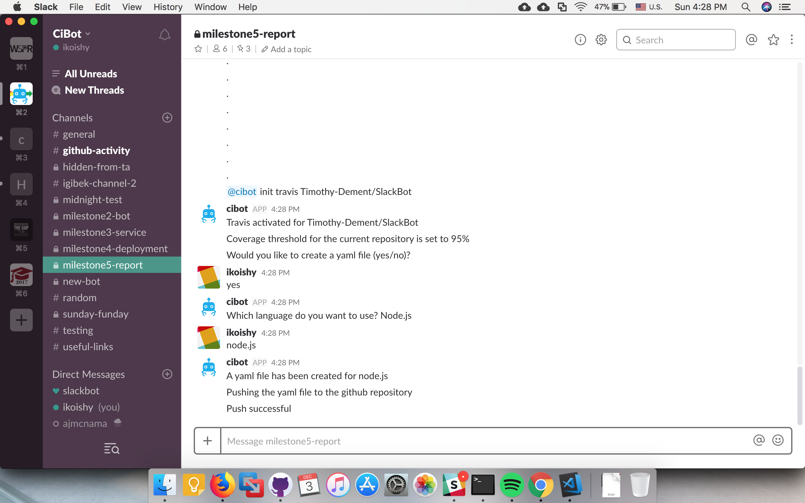
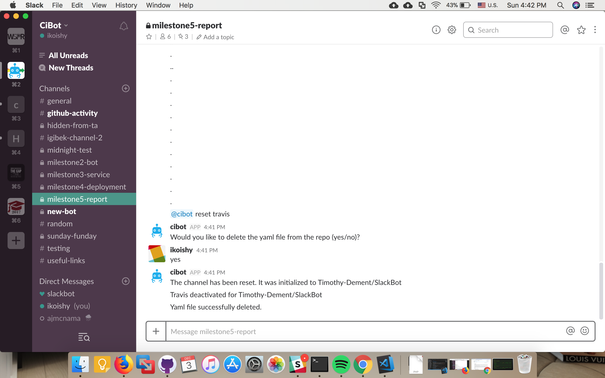
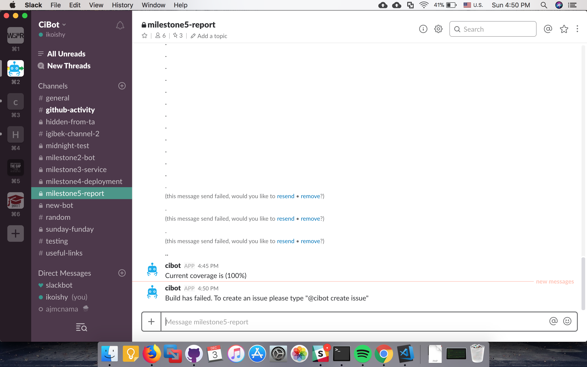
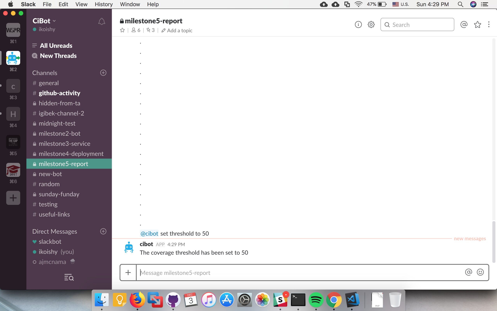
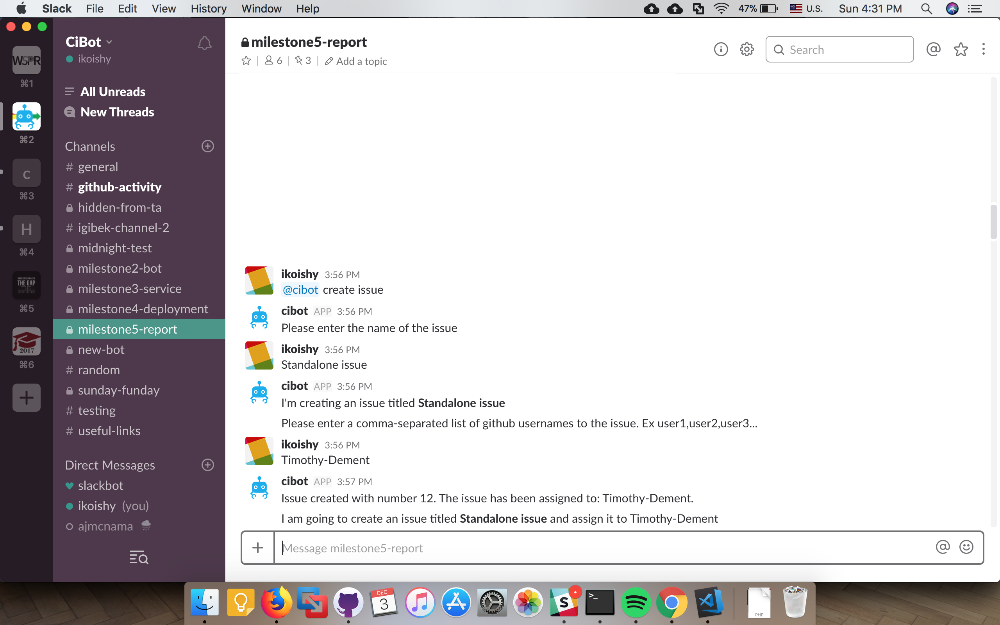
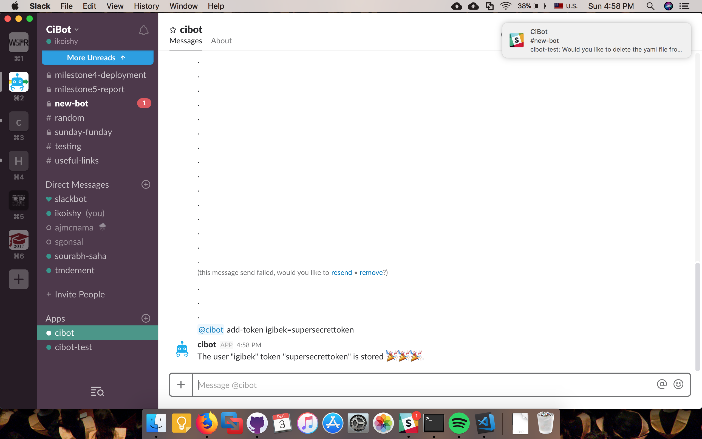
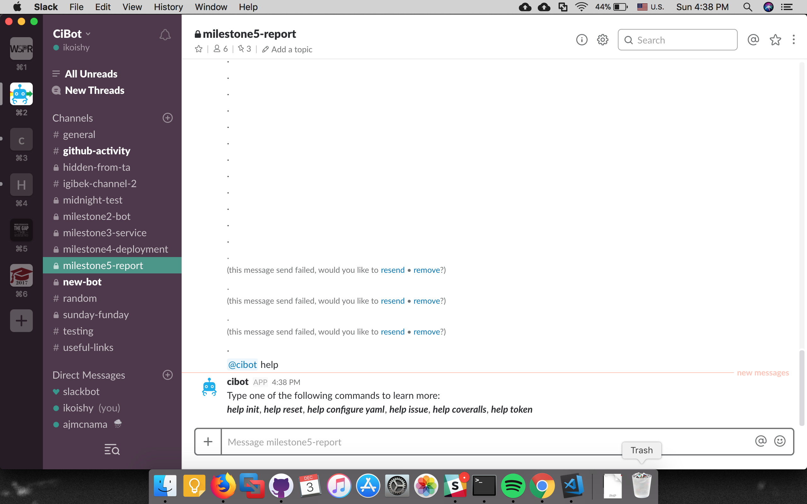

# Report Milestone

## 1. Project Presentation

Please see the video demonstration below, which illustrates the problem our bot addresses and its three primary use cases.

## 2. Report

### 2.1 Problem Solved by Bot

### 2.2 Primary Features and Screenshots
#### 2.2.1 Travis-CI Management
CiBot gives ability to manage travis continuous integration for the repository in a dedicated slack channel. Management process includes:  
1. A user can activate Travis-CI for the repository in a channel. Command `@cibot init travis {owner/repo}`. If the user wants, Cibot will create a default `.travis.yml` file and push it to the repository.

2. A user can deactivate Travis-CI for the repository in a channel. Command `@cibot reset travis`. If the user wants, Cibot can remove a default `.travis.yml` file from repository.

3. Cibot notifies a channel if build fails. A user can create an issue. Please refer to [Github Management](#github-management).

#### 2.2.2 Coveralls Management
CiBot can manage Coveralls if repository is ready.  
Management process includes:  
1. The user can set coverage threshold. Command `@cibot set threshold to {number}`  

2. Cibot notifies a channel with up-to date coverage. If coverage is below A user can create an issue. Please refer to [Github Management](#github-management).  

#### 2.2.3 Github Management
Cibot can create manage Github.  
Management process includes:
1. A user can create an issue and assign it to a repository collaborators. Command: `@cibot create issue`  

#### 2.2.4 Secondary Features
Cibot provides additional features for users' convenience.
1. A user can store Github token. The following only available as a direct message Command: `@cibot add-token`  

2. A user can request man page of Cibot. Command: `@cibot help` (`@cibot help init` `@cibot help reset` `@cibot help configure yaml` `@cibot help issue` `@cibot help coveralls` `@cibot help token`)  

### 2.3 Reflection on the Development Process and Project

The Agile methodology of having user stories helped us organize the features we were building into the bot, allowing us to divide them into manageable chunks of work that could be assigned to each of us.   
Also, the milestones were well organized that allowed us focus on the bot interactions first and then work on implementing the back-end (service) code.  
After the bot was written and developed locally, it was natural to make the progression to deploy it on a VM to verify its working in action.  
We made use of an Azure VM to deploy the bot and Ansible scripts for configuration management.
Getting the design right at the start was crucial, however we did iterate and make changes to our original design. 
With regard to productivity, the task tracking software Pivotal Tracker was used and it enabled us to evaluate the work that was being done, and what needed to be completed.  
The project encompassed a lot of important software engineering concepts such as software design, user interaction, testing, configuration management, and the agile development process.  
The deadlines were organized into approximately 3 week sprints, allowing time for weekly meetings and standups.    

### 2.4 Limitations and Future Work
#### Limitations 

There are a few limitations of the bot we have to consider before using it on slack.
1. Currently only Node.js repositories are fully supported
2. Only one repository can be initialized on a particular slack channel
3. The owner of the Github repository has to have his/her Github token made known to the bot through a direct message to the bot
4. The repository which is to be monitored through slack should have the following software configuration set-up a priori 
    1. The repository should be connected to Travis CI, a configuration management tool which runs scripts based on build success or failures
    2. The repository should be added to Coveralls, an open source tool for getting information on code coverage
    3. The repository should have a file containing test cases and a reference of this file needs to be in package.json file
#### Future Work

The following are some points which we think would be future enhancements to the bot and it’s functionality
1. We would like to extend the bot’s functionality to initialize multiple repositories in one channel
2. We would also like to add the ability to communicate with the bot to set up the testing frameworks (Mocha and Istanbul) through the slack chat interface itself, instead of having it as a prerequisite
3. Currently, the bot supports only NodeJS projects and possible future enhancement would be to extend the bot to support Java, Ruby and/or Python as well

## 3. Peer Evaluation
